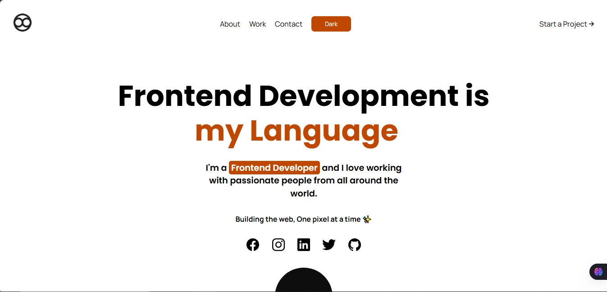

# DomRift
Personal Portfolio website for Uche Macnelson Ofatu aka DomRift. Built with vanilla JavaScript, HTML, and CSS, this project features a responsive design and theme switching.



## Features

- **Stunning Animations**:  
  This portfolio project features stunning animations using CSS and the GSAP JavaScript Library, incorporating core techniques of motion design.

- **Theme Switching**:  
  - Toggle between light and dark modes  
  - Persistent theme selection using local storage  
  - Smooth transitions between themes  

- **Responsive Design**:  
  - Mobile-first approach  
  - Adapts seamlessly to different screen sizes  

- **Smooth Page Navigation**:  
  - Navigate between sections with smooth scrolling using the Lenis Smooth Scroll Library  
  - No scroll lag for a seamless user experience  

- **Loading States and Error Handling**:  
  - Display loading indicators while fetching data  
  - Gracefully handle errors and provide user feedback  

## Technologies Used

- HTML5
- CSS3
- Vanilla JavaScript
- Lenis Smooth Scroll Library
- GSAP Animations
- Ionicons Library
- Git for version control

## Live Demo

[View Live Demo](https://macnelson9.github.io/DomRift)

## Getting Started

To run this project locally:

```bash
# Clone the repository
git clone https://github.com/macnelson9/DomRift.git

# Navigate to the project directory
cd DomRift

# Open with live server or your preferred method
```

## What I Learned

This project was a comprehensive learning experience that allowed me to refine my skills in frontend development. Here are the key takeaways:

- **GSAP Animations**:  
  - Implemented advanced animations using GSAP, including the `TextPlugin` for typewriter effects and `ScrollTrigger` for scroll-based animations.  
  - Learned how to create reusable timelines and manage animation states effectively.  

- **Lenis Smooth Scroll**:  
  - Integrated the Lenis Smooth Scroll Library for a seamless scrolling experience.  
  - Fixed issues with scroll lag and ensured compatibility with GSAP's `ScrollTrigger`.  

- **Theme Switching**:  
  - Developed a light/dark theme toggle with smooth transitions.  
  - Used local storage to persist user preferences across sessions.  
  - Enhanced the user experience by ensuring all elements, including icons and buttons, adapt to the selected theme.  

- **DOM Manipulation**:  
  - Efficiently manipulated the DOM to handle dynamic content, animations, and user interactions.  
  - Improved performance by optimizing event listeners and reducing redundant DOM queries.  

- **Error Handling**:  
  - Implemented robust error handling for fetch requests, ensuring users receive clear feedback in case of failures.  

- **Responsive Design**:  
  - Applied a mobile-first approach to ensure the website looks great on all screen sizes.  
  - Used media queries and flexible layouts to adapt the design seamlessly.  

- **Custom Cursor and Magneto Button**:  
  - Created a custom animated cursor and a "magneto" button effect using GSAP for an interactive user experience.  
  - Fixed alignment and responsiveness issues for these elements.  

- **Loading States**:  
  - Added a preloader animation to enhance the initial user experience.  
  - Ensured the loader disappears smoothly after the page content is ready.  

- **Code Optimization**:  
  - Refactored JavaScript code to improve readability and maintainability.  
  - Organized CSS styles for better scalability and ensured consistent use of variables for colors and transitions.  

- **Accessibility Improvements**:  
  - Ensured proper semantic HTML structure for better accessibility.  
  - Added alt attributes to images and improved keyboard navigation.  

## Useful Resources

- [MDN Web Docs](https://developer.mozilla.org) - Essential JavaScript concepts  
- [CSS-Tricks](https://css-tricks.com) - Theme switching implementation references  
- [GSAP Documentation](https://greensock.com/docs/) - For advanced animation techniques  
- [Lenis Documentation](https://github.com/studio-freight/lenis) - Smooth scroll library  
- [Ionicons Official Website](https://ionic.io/ionicons)  

## Author

- GitHub - [@macnelson9](https://github.com/Macnelson9)  
- X - [@macnelson92](https://x.com/Macnelson92?t=vAGEJQcCttdqKd8NKfda2A&s=09)  
- LinkedIn - [@Uche Ofatu](https://www.linkedin.com/in/uche-ofatu)  
- Facebook - [@Uche Michael](https://www.facebook.com/micheal.okpara.52)  

## Acknowledgments

- Inspiration from Adi Purdila @ Envato Tuts+ channel on YouTube for the Basics of Motion Design Course.